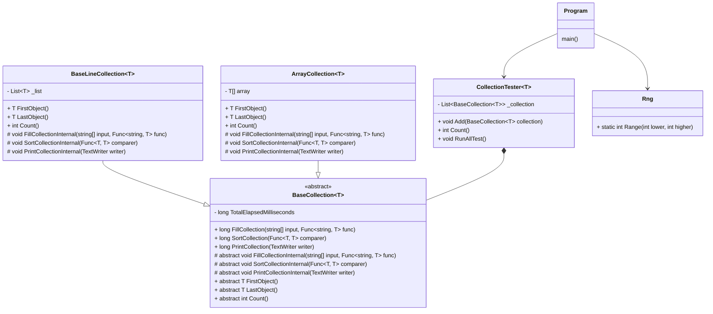

# Test af collections
I skal teste forskellige implementeringer af collections. Hvilke er hurtigst, hvilke
fordel/ulemper har de forskellige
I skal bruge koden Collection:
1. I skal for alle de collection I vil afprøve lave en klasser der nedarver fra BaseCollection<T>
2. Sammenlign de forskellige resultater.
3. Ekstra: Omskriv testen til at bruge et objekt med en property for int og string.
4. Er der andre test der vil være relevante?
5. Hvordan er ConcurrentCollection til sammenligning?

